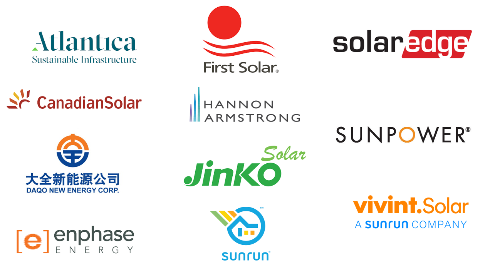

# ** VBC for the Stock Market**

## Overview of Project.

-This project was the challenge for module 2 of the Data Analysis  Bootcamp  Texas University At Austin
The objective was to  develop macros in excel using VBA (Visual Basic for Applications)
The final result was to be able to refactor the code and impove the time the macro takes to run the code.

-In this project  we  use real data of 12  clean energy companies that are in the US stock market
We had data of their stock prices of the years 2017  and 2018
(See image below)

- 
- You can see the image of [Outcomes Based on launch date](Resources/tickers.png) here.

### Results

- The objective of this challenge is to utilize the excel skills  that we learned in Module 1.
- We'll also start analyzing the visualizations (Pivot Graphs) in order to be able to tell a story based on the data.

## Summary

- I had the opportunity to make some tables and graphs and I could get some interesting insights from them.
- Generally speaking I had to pay special attention to every line in the instructions, If you don't do this you can miss an important instruction and have an incomplete task in the challenge.

### Analysis of Outcomes Based on Launch Date

- 

	- You can see the image of [Outcomes Based on launch date](resources/Outcomes_vs_Goals.png) here.

