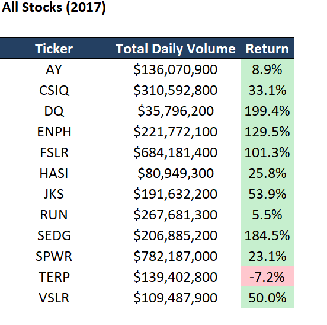
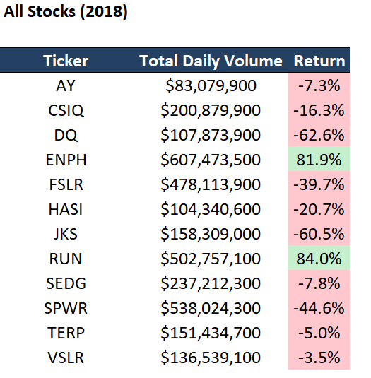
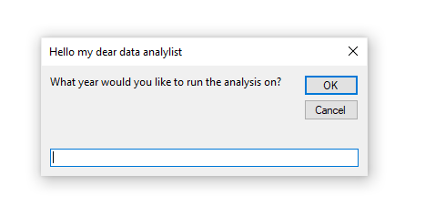
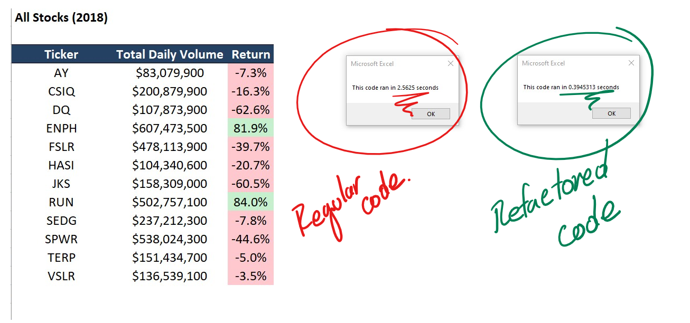
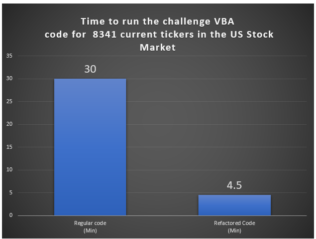

# ** VBC for the Stock Market**

## Overview of Project.

-This project was the challenge for module 2 of the Data Analysis  Bootcamp  Texas University At Austin
The objective was to  develop macros in excel using VBA (Visual Basic for Applications)
The final result was to be able to refactor the code and improve the time the macro takes to run the code.

-In this project  we  use real data of 12  clean energy companies that are in the US stock market
We had data of their stock prices of the years 2017  and 2018
(See image below)

- 
- You can see the image of [tickers used in analysis](Resources/tickers.png) here.

	
VBA_Challenge_2017

## Results

- The macro creates a table of the 12 different tickers where we can see data such as: Total Daily Volume, and the return of investment  either in 2017 or 2018
- 
### 2017
- 

### 2018
- 

-The macro launches a pop-up window and collects inputs from the user to determine if the data will be for 2017 or 2018

- 

- For-loops and conditionals to direct logic flow were used
- Nested for loops were also utilized

- Coding skills such as syntax recollection, pattern recognition, problem decomposition, and debugging were developed in this challenge.
- Arrays were created

- Code was refactored to improve the execution time of the macro.

The image below shows the differences in running time of the regular code developed during the module 2 and the refactored code that was created for this challenge.

- 

## Summary

-It is amazing to see how excel and VBA can help automate calculations.
The use of for-loops and conditionals, Arrays and indexation of arrays are key for the success of creating efficient macros.

-Refactoring is crucial to improve the performance of Macros.
We can see  that If we had to run this same macro for all the tickers in the US stock market  
the regular code would take about 30 minutes to execute the macro while
the refactored code would only take about 4.5 minutes.

- 
